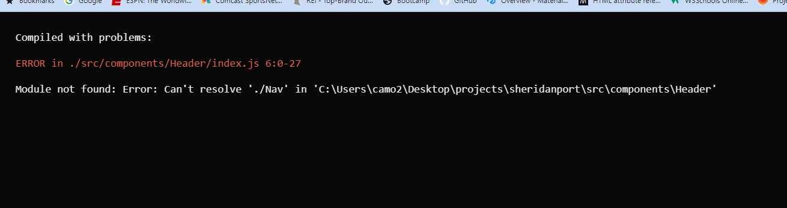
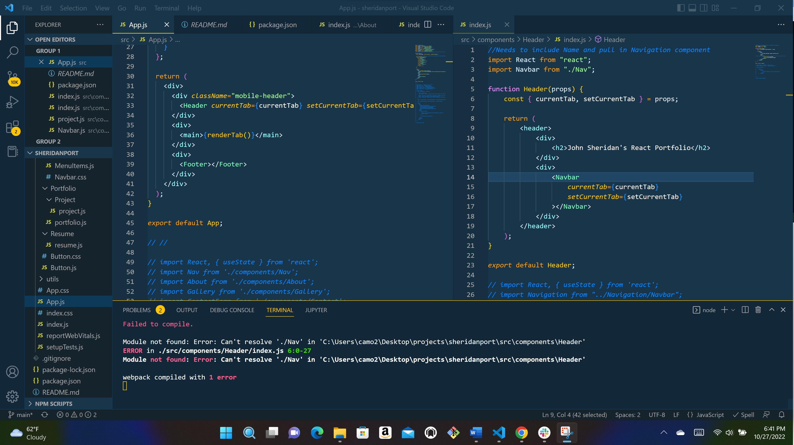

Create React App - Sheridan Portfolio

This app was created to showcase projects and applications on a single web application using React.  

It is intended to have a navigation bar with buttons for an About Me section, Resume, Portfolio (with project examples), and a page to contact the developer.

I am currently running into issues with the code, the Header file will not properly import the Navbar file so now nothing will run as intended.  I will be working to problem solve this issue and redeploy the application when it is fixed.

I will also be checking to make sure all dependencies are installed.